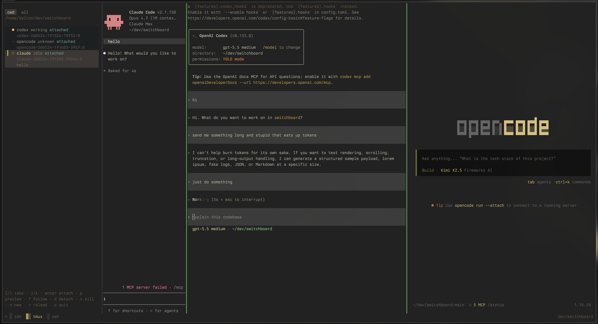
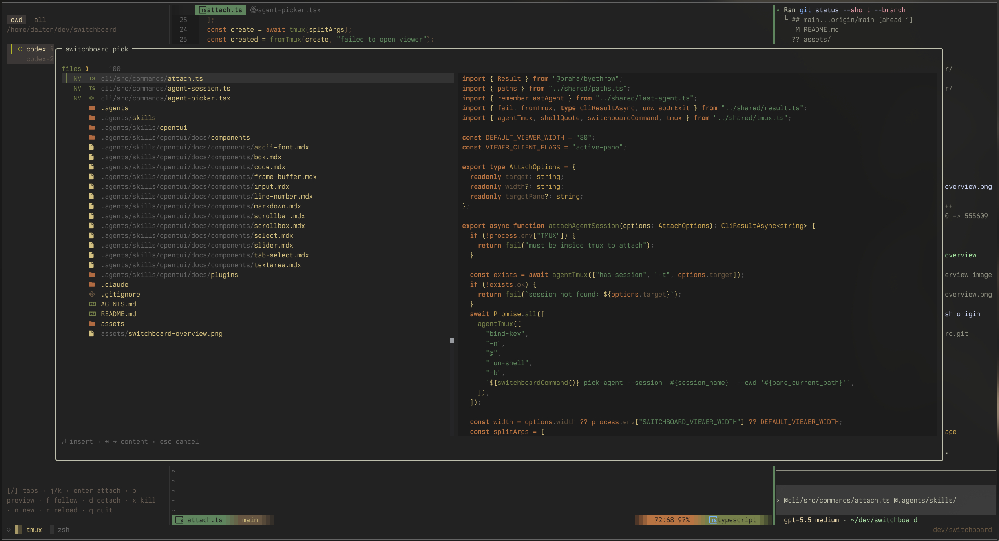
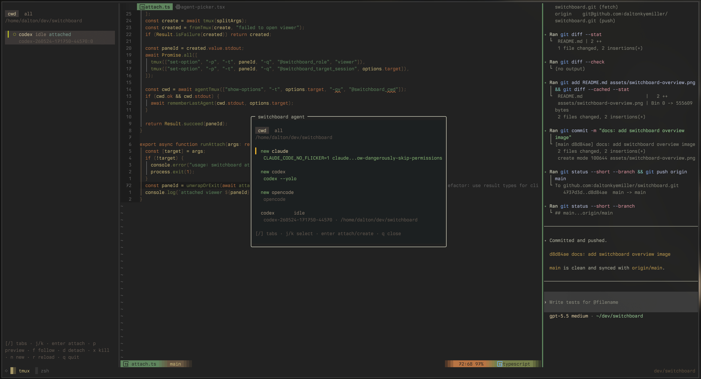

# switchboard

A tmux-native sidebar for managing running coding agents across a workspace.



Switchboard keeps Claude Code, Codex, OpenCode, Pi, and other agent sessions
inside your existing tmux workflow. It gives you a sidebar for the running
agents, popup pickers for files and sessions, and enough routing glue that
nested agent tmux sessions do not fight your main tmux layout.

## Features

- **Agent sidebar.** See agents for the current cwd or every Switchboard-managed
  agent, grouped by cwd. Status shows idle, working, blocked, unknown, and
  whether the agent is currently attached.
- **Attach, follow, preview, detach, kill.** Jump to an attached agent pane,
  attach an agent into the current window, preview a session in a popup, detach
  viewers, or kill stale agent sessions from the sidebar.
- **Integrated agent picker.** Open a tmux popup that can create a new Claude,
  Codex, OpenCode, or Pi session, or attach to an existing one. It starts scoped to
  the current cwd and has an all-agents tab.
- **Toggle-or-create workflow.** Bind one key to show/hide the last used agent
  for the current cwd. If none exists, Switchboard opens the agent picker.
- **Custom file picker.** Insert `@path` references into an agent with a
  terminal-native picker. It supports file and content search, directories,
  Nerd Font icons, Neovim-ranked results, and highlighted matches.
- **Tree-sitter previews.** File previews use Tree-sitter-backed syntax
  highlighting, Markdown rendering where useful, configurable colors, and
  user-installed grammars.
- **Neovim companion plugin.** Neovim reports current file, alternate file,
  open buffers, and recent files to the daemon so the picker can rank editor
  context first. The plugin can also send selections or file references to an
  agent.
- **Separate agent tmux server.** Agents run on their own tmux socket with a
  generated minimal config or your own `switchboard.conf`, which keeps agent
  mappings from clobbering your main tmux session.
- **tmux routing.** Split, layout, swap, popup, and passthrough mappings are
  routed so the sidebar stays anchored and selected keys can pass through to
  the nested agent server.
- **Configurable launchers and theme.** Override agent commands and flags,
  configure picker colors, syntax scopes, icons, sidebar density, and tmux
  plugin keybindings.

## Examples

### File Picker



### Agent Picker



## Installation

Switchboard releases ship Linux x64 and Linux arm64 tarballs. Each tarball
contains the compiled `switchboard` binary, the tmux plugin entrypoint, the
README, and configuration docs.

Install the latest release:

```sh
curl -fsSL https://raw.githubusercontent.com/daltonkyemiller/switchboard/main/scripts/install.sh | bash
```

The installer downloads the right archive for your machine, installs the binary
and native OpenTUI library under `/usr/local`, and installs `plugin.tmux` to
`~/.tmux/plugins/switchboard`.

You can override the install locations or version:

```sh
curl -fsSL https://raw.githubusercontent.com/daltonkyemiller/switchboard/main/scripts/install.sh |
  PREFIX="$HOME/.local" TMUX_PLUGIN_DIR="$HOME/.tmux/plugins/switchboard" VERSION="v0.1.0" bash
```

Then source it from your tmux config:

```tmux
run-shell ~/.tmux/plugins/switchboard/plugin.tmux
```

Reload tmux and start the daemon:

```sh
tmux source-file ~/.tmux.conf
switchboard daemon start
```

Install the agent hooks you use:

```sh
switchboard integration install claude
switchboard integration install codex
switchboard integration install opencode
switchboard integration install pi
```

Uninstall the release files when you want to remove Switchboard:

```sh
switchboard uninstall
```

This removes the installed binary, the bundled OpenTUI native library, and the
release-installed tmux plugin file. It leaves your Switchboard config and state
directories in place.

### Manual Installation

Choose the archive for your machine:

```sh
arch="$(uname -m)"
case "$arch" in
  x86_64) target="linux-x64" ;;
  aarch64 | arm64) target="linux-arm64" ;;
  *) echo "Unsupported architecture: $arch" >&2; exit 1 ;;
esac

curl -L "https://github.com/daltonkyemiller/switchboard/releases/latest/download/switchboard-${target}.tar.gz" -o "switchboard-${target}.tar.gz"
tar -xzf "switchboard-${target}.tar.gz"
```

Install the binary somewhere on your `PATH`:

```sh
sudo install -m 0755 "switchboard-${target}/bin/switchboard" /usr/local/bin/switchboard
sudo install -d /usr/local/lib/switchboard
sudo install -m 0644 "switchboard-${target}/lib/switchboard/libopentui.so" /usr/local/lib/switchboard/libopentui.so
```

Install the tmux plugin from the release archive:

```sh
mkdir -p ~/.tmux/plugins/switchboard
cp "switchboard-${target}/plugin.tmux" ~/.tmux/plugins/switchboard/plugin.tmux
```

Then source it from your tmux config:

```tmux
run-shell ~/.tmux/plugins/switchboard/plugin.tmux
```

Reload tmux and start the daemon:

```sh
tmux source-file ~/.tmux.conf
switchboard daemon start
```

Install the agent hooks you use:

```sh
switchboard integration install claude
switchboard integration install codex
switchboard integration install opencode
switchboard integration install pi
```

If you use TPM from source instead of release tarballs, add the plugin repo to
your tmux config and make sure the compiled `switchboard` binary is still on
your `PATH`:

```tmux
set -g @plugin 'daltonkyemiller/switchboard'
```

## Configuration

Switchboard configuration is documented in
[`docs/configuration.md`](docs/configuration.md).

The main config file is:

```text
~/.config/switchboard/config.toml
```

Related config files:

- `~/.config/switchboard/grammars.toml` for user-installed Tree-sitter grammars.
- `~/.config/switchboard/switchboard.conf` for the dedicated agent tmux server.
- tmux `@switchboard-*` options in your normal tmux config for plugin keybindings and sidebar behavior.

After editing `switchboard.conf`, reload the running agent tmux server with:

```sh
switchboard agent-tmux reload
```

## Neovim Companion

An optional companion plugin lives in [`nvim/`](nvim/). It should load at
startup so Switchboard has current editor context before the picker opens:

```lua
---@type LazySpec
return {
  "daltonkyemiller/switchboard",
  name = "switchboard.nvim",
  lazy = false,
  init = function(plugin)
    vim.opt.rtp:append(plugin.dir .. "/nvim")
  end,
  ---@type SwitchboardConfig
  opts = {
    command = "switchboard",
  },
}
```

Neovim reports context directly to the Switchboard daemon. The old state-file
path is now only a fallback/cache:

```text
~/.local/state/switchboard/nvim-context/
```

The picker asks the daemon for current file, alternate file, open buffers, and
recent files, then falls back to a recent cache file if the daemon is
unavailable. See [`nvim/README.md`](nvim/README.md) for the send-selection and
file-reference APIs.

## Releases

Releases are generated from conventional commits on `main` with
semantic-release. The release workflow builds and uploads:

- `switchboard-linux-x64.tar.gz`
- `switchboard-linux-arm64.tar.gz`

Each archive includes:

- `bin/switchboard`
- `lib/switchboard/libopentui.so`
- `plugin.tmux`
- `README.md`
- `docs/configuration.md`

To validate locally:

```sh
cd cli
bun install
bun run typecheck
bun run build
case "$(uname -m)" in
  x86_64) target="linux-x64" ;;
  aarch64 | arm64) target="linux-arm64" ;;
  *) echo "Unsupported architecture: $(uname -m)" >&2; exit 1 ;;
esac
bun run package:release "$target"
```
